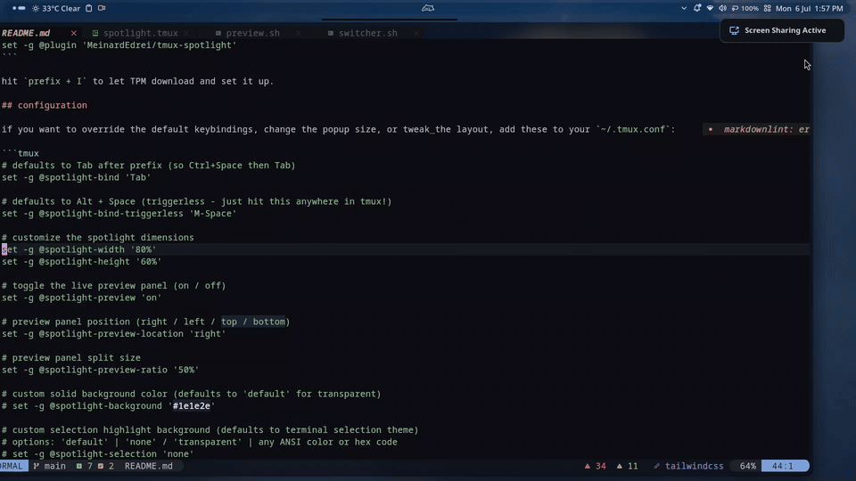

<p align="center">
  
</p>

<h1 align="center">tmux-spotlight</h1>

A fast, minimalist [tmux](https://github.com/tmux/tmux) session manager and window switcher, powered by [fzf](https://github.com/junegunn/fzf). Fuzzy-find windows, panes, and sessions, launch named project sessions from `zoxide`/`fd` — even from a cold shell before tmux is running — search scrollback live, and rename/clean up on the fly, all from one Spotlight-style popup.

I wanted a MacBook-like app switcher for my tmux environment but found existing plugins too cluttered and noisy. So I wrote this. It focuses strictly on window and session management — keeping things minimal, fast, and visually clean without looking like a 90s terminal wizard.



*fuzzy searching windows, launching named sessions from a folder, and cleaning up hoarded ones.*

## Features

- **Minimal Dependencies:** Just `bash`, `tmux`, and `fzf` (plus `zoxide` and `fd` for folder launching).
- **Named Session Launcher:** Pick a folder and instantly launch or switch to a session auto-named after it. Typing a name with no matches creates a brand-new session under that name.
- **Standalone Launch:** Run it from a plain shell with no tmux running yet — a `tsp` command (auto-installed) opens the same folder picker and attaches you straight into the right project session.
- **Pane-Level Jumping:** Switch to a specific pane, not just its window — each row is labeled by what's actually running in it (`nvim`, `npm run dev`, etc.).
- **Scrollback Search:** Fuzzy-search a window's terminal history across every pane, live — no autosave daemon or snapshot required. (Full-screen apps like Neovim only expose their current screen — see [note](#scrollback-search-limitation).)
- **Live Previews:** See terminal contents or directory listings on hover, colors stripped for clean rendering.
- **Clean Grid Layout:** Session names shown inline for every window — colored when that session is open elsewhere, distinct from the color marking the window you're actually in.
- **MRU Ordering:** Your most recently used windows float to the top, tracked from the popup and native tmux navigation alike.
- **Inline Renaming:** Rename the highlighted window or session directly from the popup.
- **Quick Cleanup:** Close windows instantly; killing a session requires confirmation first, since it takes every window with it.
- **Cancel-Friendly Prompts:** Rename cancels instantly on Esc — kill-session requires explicitly typing `y`/`Y`, so Enter alone never confirms it.
- **In-Popup Help:** Press `?` anytime for a cheatsheet reflecting your actual configured binds.

## Installation

**Requirement:** [fzf](https://github.com/junegunn/fzf). [zoxide](https://github.com/ajeetdsouza/zoxide) and [fd](https://github.com/sharkdp/fd) are recommended for folder search — without them, folder mode shows a warning instead of a silent empty list.

Using [TPM](https://github.com/tmux-plugins/tpm), add this to your `~/.tmux.conf`:

```tmux
set -g @plugin 'MeinardEdrei/tmux-spotlight'
```

Then hit `prefix + I` to fetch and install the plugin.

## Keybindings

### Launching the popup

| Key | Action |
|---|---|
| `prefix + Tab` | Open the popup (default, inside tmux) |
| `Alt + Space` | Open the popup, no prefix needed, works anywhere in tmux |
| `tsp` (in any shell) | Open it **outside tmux entirely** — picks a folder and attaches into a session. Auto-installed on first plugin load; see [Standalone Launch](#standalone-launch) below. |
| `Alt + b` | Jump straight back to your **previously active window** — no popup needed, toggles back and forth like macOS `Cmd+Tab`. |

### Inside the popup

| Key | Action |
|---|---|
| `Enter` / `Alt + m` | Switch to the highlighted window, or launch/attach a **named session** for a folder |
| *(type a name with no matches, then `Enter`/`Alt + m`)* | Create a brand-new session under that name |
| `Alt + f` | Switch to **project folders** (`zoxide` + `fd`) |
| `Alt + w` | Switch to **open windows** |
| `Alt + e` | Switch to **panes** — jump to a specific split, not just its window |
| `Alt + h` / `Alt + l` | Cycle to the previous / next mode (windows → folders → panes) — alternative to jumping directly above |
| `Alt + j` `Alt + n` / `Alt + k` `Alt + p` | Move down / up (wraps at the top/bottom) |
| `Home` / `End` | Jump straight to the first / last item |
| `Alt + r` | Rename the highlighted **window** |
| `Alt + s` | Rename the **session** the highlighted window belongs to |
| `Alt + q` | Close the highlighted **window** |
| `Alt + z` | Close the highlighted **pane** (pane mode only) |
| `Alt + x` | Kill the highlighted **session** (confirmation required) |
| `Alt + /` | **Scrollback search** — fuzzy-search every pane's history in the highlighted window, live, and jump to that line in copy-mode |
| `?` | Show the keybindings cheatsheet — reflects your actual configured binds, not just these defaults |

A small "`?` for help" hint stays visible above the list by default so this table isn't something you need to memorize — disable it with `@spotlight-show-help-hint 'off'` if you'd rather not see it.

## Configuration

Add any of these to your `~/.tmux.conf` to override the defaults.

<details>
<summary><strong>Launching &amp; dimensions</strong></summary>

```tmux
set -g @spotlight-bind 'Tab'
set -g @spotlight-bind-triggerless 'M-Space'
set -g @spotlight-bind-jump-back 'M-b'
set -g @spotlight-width '80%'
set -g @spotlight-height '60%'
```
</details>

<details>
<summary><strong>Live preview</strong></summary>

```tmux
set -g @spotlight-preview 'on'
set -g @spotlight-preview-location 'right'
set -g @spotlight-preview-ratio '50%'
```
</details>

<details>
<summary><strong>Styling</strong></summary>

```tmux
# custom solid background color (defaults to 'default' for transparent)
# set -g @spotlight-background '#1e1e2e'

# custom selection highlight background
# options: 'default' | 'none' / 'transparent' | any ANSI color or hex code
# set -g @spotlight-selection 'none'
```
</details>

<details>
<summary><strong>Keybinds (fzf bind syntax)</strong></summary>

```tmux
# set -g @spotlight-bind-folders 'alt-f'
# set -g @spotlight-bind-windows 'alt-w'
# set -g @spotlight-bind-panes 'alt-e'
# set -g @spotlight-bind-mode-prev 'alt-h'
# set -g @spotlight-bind-mode-next 'alt-l'
# set -g @spotlight-bind-accept 'alt-m'
# set -g @spotlight-bind-kill-session 'alt-x'
# set -g @spotlight-bind-kill-window 'alt-q'
# set -g @spotlight-bind-kill-pane 'alt-z'
# set -g @spotlight-bind-rename 'alt-r'
# set -g @spotlight-bind-rename-session 'alt-s'
# set -g @spotlight-bind-scrollback 'alt-/'
# set -g @spotlight-bind-help '?'
```
> The default `?` bind means typing a literal `?` no longer filters the search box — change it if you regularly search for text containing one.
</details>

<details>
<summary><strong>Help hint</strong></summary>

```tmux
# show a small "? for help" hint above the list (defaults to 'on')
# set -g @spotlight-show-help-hint 'off'
```
</details>

<details>
<summary><strong>Folder search</strong></summary>

```tmux
# search root directory (defaults to $HOME)
# set -g @spotlight-folders-dir '$HOME'

# extra comma-separated directories to exclude, on top of the built-in
# defaults (.git, node_modules, .cache, .cargo, .npm, .mozilla, .local)
# set -g @spotlight-folders-exclude 'vendor,target,.venv'
```
</details>

<details id="standalone-launch">
<summary><strong>Standalone launch (the <code>tsp</code> shell alias)</strong></summary>

A `tsp` alias/function is installed automatically the first time the plugin loads (shell detected via tmux's `default-shell`, and skipped if already installed). Run `tsp` from any terminal — tmux running or not — to open straight into folder-search mode and **attach** into the picked/created session.

```tmux
# set -g @spotlight-auto-alias 'off'      # disable auto-install
# set -g @spotlight-alias-name 'yourname' # customize the alias (default: tsp)
```

To install manually instead: `~/.tmux/plugins/tmux-spotlight/scripts/install-shell-alias.sh [alias-name]`
</details>

MRU ordering is tracked in `~/.cache/tmux-spotlight/mru` — delete it anytime to reset back to tmux's default order.

<a id="scrollback-search-limitation"></a>
> **Scrollback search limitation:** panes running full-screen apps (Neovim, `less`, `htop`, etc.) only ever expose their current screen. Those apps use the terminal's alternate-screen mode, which by design isn't recorded in scrollback at all — in tmux or any terminal.

## Roadmap

<details open>
<summary><strong>v2.0.0 — shipped</strong></summary>

- [x] Zoxide + fd workspace launcher
- [x] Live previews (terminal contents / directory listings)
- [x] Quick cleanup (kill sessions/windows from the popup)
- [x] Clean grid layout with dynamic emoji coding
- [x] Session name display, colored by attach state
- [x] Inline renaming (windows and sessions)
- [x] Named session launching from zoxide/fd folders
- [x] MRU ordering
- [x] Standalone launch (works outside tmux entirely)
- [x] Pane-level jumping
- [x] In-popup help (`?`) reflecting actual configured binds
- [x] Configurable folder excludes
- [x] Scrollback search, live, no persistence layer
- [x] Mode cycling (`Alt+h`/`Alt+l`)
</details>

<details open>
<summary><strong>v2.1+ — planned</strong></summary>

- [ ] **Universal Search** — blend windows, panes, folders, and scrollback matches into one ranked list instead of requiring a mode toggle first
- [ ] **Tmux Command Palette** — fuzzy-run tmux actions (split, sync-panes, toggle status bar, resize, kill-server) without memorizing prefix-key combos
- [ ] **Undo-Safety on Kill** — a brief grace window to undo a session kill, on top of the existing confirmation
- [ ] **First-Run Welcome Tip** — a one-time message pointing new users to `?`
- [ ] **Accessibility** — `NO_COLOR` support and a colorblind-safe palette option
- [ ] **Uninstall/Cleanup Helper** — a script to cleanly remove the MRU cache and shell alias
- [ ] **Theme Presets** — `catppuccin`, `nord`, `gruvbox`, `tokyonight`
</details>
