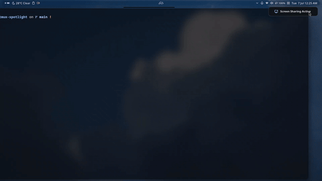

# tmux-spotlight

A fast, minimalist fuzzy finder for tmux windows and sessions, powered by `fzf`.

I wanted a MacBook-like app switcher for my tmux environment but found existing plugins too cluttered and noisy. So I wrote this. It currently focuses strictly on window and session management—keeping things minimal, fast, and visually clean without looking like a 90s terminal wizard.



*fuzzy searching windows and killing hoarded sessions.*

## Features

- **Minimal Dependencies:** Just `bash`, `tmux`, and `fzf` (plus `zoxide` for folder launching).
- **Zoxide Workspace Launcher:** Toggle to folder-search mode to search frequently visited directories and launch new windows instantly.
- **Live Previews:** See active terminal contents or directory file listings on hover. Background colors are stripped to keep code and directories looking clean.
- **Clean Grid Layout:** Information aligns on a neat vertical grid for fast visual parsing.
- **Quick Cleanup:** Kill entire sessions or close individual windows directly inside the picker. The popup reloads instantly.

## Installation

**Requirement:** Ensure [fzf](https://github.com/junegunn/fzf) is installed. [zoxide](https://github.com/ajeetdsouza/zoxide) is recommended for directory launching features.

Using [TPM](https://github.com/tmux-plugins/tpm), add this to your `~/.tmux.conf`:

```tmux
set -g @plugin 'MeinardEdrei/tmux-spotlight'
```
Then hit `prefix + I` to fetch and install the plugin.

## Keybindings

### Launching

- `prefix + Tab` (Default)
- `Alt + Space` (Triggerless default — use anywhere in tmux)

### Inside the Popup

- `Enter` : Switch to selection or launch folder (creates a new window in that path)
- `Alt + f` : Switch to **project folders** (reads your `zoxide` directory database)
- `Alt + w` : Switch back to **open windows**
- `Alt + x` : Kill the highlighted **session** (reloads list)
- `Alt + q` : Close the highlighted **window/tab** (reloads list)
- `Alt + r` : Rename the highlighted **window/tab** (prompts for a new name, reloads list)

## Configuration

You can override the defaults by adding any of these variables to your `~/.tmux.conf`:

```tmux
# Keybindings
set -g @spotlight-bind 'Tab'
set -g @spotlight-bind-triggerless 'M-Space'

# Dimensions
set -g @spotlight-width '80%'
set -g @spotlight-height '60%'

# Live Preview Settings
set -g @spotlight-preview 'on'
set -g @spotlight-preview-location 'right'
set -g @spotlight-preview-ratio '50%'

# Styling
# custom solid background color (defaults to 'default' for transparent)
# set -g @spotlight-background '#1e1e2e'

# custom selection highlight background (defaults to terminal selection theme)
# options: 'default' | 'none' / 'transparent' | any ANSI color or hex code
# set -g @spotlight-selection 'none'

# customize popup hotkeys (fzf bind syntax)
# set -g @spotlight-bind-folders 'alt-f'
# set -g @spotlight-bind-windows 'alt-w'
# set -g @spotlight-bind-kill-session 'alt-x'
# set -g @spotlight-bind-kill-window 'alt-q'
# set -g @spotlight-bind-rename 'alt-r'

# search root directory for folder mode (defaults to $HOME)
# set -g @spotlight-folders-dir '$HOME'
```

## Roadmap

- [x] Zoxide + fd workspace launcher (search & open project folders instantly)
- [x] Live previews (terminal contents / directory listings)
- [x] Quick cleanup (kill sessions/windows from the popup)
- [x] Clean grid layout with dynamic emoji coding
- [x] Session Name Display — show the session a window belongs to directly in the list, not just its window name/path
- [x] Inline Renaming (windows) — rename tmux windows directly from inside the popup
- [ ] Inline Renaming (sessions) — rename tmux sessions directly from inside the popup
- [ ] Theme Presets — out-of-the-box support for `catppuccin`, `nord`, `gruvbox`, `tokyonight`
- [ ] Smart Filtering — QoL toggles like hiding the current active window from the search list
- [ ] Named Session Launching — folders opened via zoxide/fd auto-create a session named after the directory (instead of a numeric default), and typing a brand-new query creates a session under that name
- [ ] MRU Ordering — sort the window list by most-recently-used instead of tmux's default creation order, so your last few windows surface first
